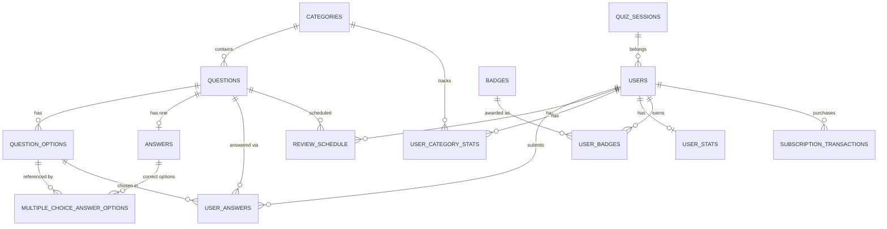

# Trivia / Quiz Database Schema

This document explains the reasoning behind `schema.sql`. For exact column types, defaults, and index definitions, the SQL file itself is the source of truth — this is the "why," not a column-by-column restatement of the "what."

## Overview

This schema backs a trivia/quiz application. It supports three question formats — single choice, multiple choice, and fill-in-the-blank — organized under a hierarchical category tree, with per-user submission tracking, automatic grading, a simplified SM-2 spaced-repetition scheduler, and a lightweight gamification layer (badges, login streaks, per-category accuracy). It leans heavily on triggers and `CHECK` constraints rather than application-level validation: most of the rules that keep the data consistent — locking a question's type once it has an answer, requiring the right answer column for the right question type, computing whether a submission is correct — are enforced by Postgres itself, not by the app.

## Requirements & setup

Requires PostgreSQL 18 or later: the schema uses `uuidv7()` for user IDs (native starting in 18) and `GENERATED ... STORED` columns for full-text search. Two extensions are needed — `ltree` for the category tree's hierarchical paths, and `citext` for case-insensitive email matching. Everything is created in dependency order in a single pass, so it can be applied directly against an empty database:

```bash
psql -d your_database -f schema.sql
```

## Entity relationships

The diagram below covers the structural foreign keys. A few of the rules described later — which option a correct answer is allowed to point to, who's allowed to delete what — are enforced by triggers rather than by the relationships themselves, so they don't show up here.



## Walkthrough

### Categories

Categories form a tree (e.g. Science → Biology → Genetics) stored as `ltree` paths rather than a self-referencing `parent_id` column. That choice is what makes `categories_with_depth` and `categories_with_parent` possible as plain views instead of recursive CTEs: `nlevel(path)` gives the depth and `subpath(path, 0, nlevel(path)-1)` gives the parent's path directly, no recursion required. A GiST index on `path` supports the `ltree` ancestor/descendant operators (`<@`, `@>`, `~`) efficiently, and a separate btree index speeds up exact-path lookups and ordering. Moving a subtree means updating the path prefix on every descendant row; nothing else has to change.

Each category has a `tier` (0 = free, 1 = $10.99, 2 = $50.99). Users with `tier = 0` see only `tier = 0` categories. Users with `tier = 1` see `tier <= 1`. The category tree endpoint filters accordingly using the user's current tier from the database (queried live on every request — not from a stale JWT claim). Creating a quiz session for a category also validates the user's tier against the category's tier.

### Question types and the "enum decides the column" pattern

`question_type` is the single enum everything else keys off. It lives on `questions`, and is mirrored automatically — never trusted from client input — onto both `answers` and `user_answers` via `BEFORE INSERT` triggers (`sync_answer_question_type`, `sync_user_answer_type`) that copy it straight from the parent question. Once a row has its `question_type` set, a `CHECK` constraint (`answers_column_matches_type`, `user_answers_column_matches_type`) requires that exactly the column matching that type be populated and every other type-specific column be `NULL`. It's the same idea as a tagged union, enforced declaratively instead of in application code.

### Questions, options, and canonical answers

`questions` holds the prompt text plus a generated `tsvector` column (`search_vector`) kept in sync automatically for full-text search, indexed with GIN. `question_options` holds the answer choices for `single_choice` and `multiple_choice` questions; a trigger blocks attaching options to a `fill_in_blank` question entirely.

`answers` holds exactly one canonical correct answer per question (enforced by a `UNIQUE` constraint on `question_id`), shaped differently depending on `question_type`. `single_choice` points at one row in `question_options` through a plain foreign key. `fill_in_blank` stores the accepted text plus an optional array of accepted alternate spellings. `multiple_choice` has no answer column on the `answers` row at all — its correct options live in `multiple_choice_answer_options`, a separate join table. That table exists specifically because an array column (`BIGINT[]`) can't carry a real foreign key the way a scalar column can, so it can't natively stop someone from deleting a `question_options` row that's part of a correct answer, or from referencing an option that belongs to a different question entirely. A trigger on the join table checks the latter; a foreign key with `ON DELETE RESTRICT` (mirroring `single_choice_answer`'s own behavior) handles the former for free, no custom code needed. A `multiple_choice` answer is also required to have at least one row in that join table — since a `CHECK` constraint can't reach across two tables, that rule is enforced by a deferred constraint trigger instead, deferred so a transaction can insert the `answers` row and its option rows as separate statements and only be validated once, at commit.

Once a question has an answer recorded, its `question_type` is locked (`trg_lock_question_type`): changing `single_choice` to `multiple_choice` or vice versa on an already-answered question would silently orphan whichever answer column was already populated, so the trigger blocks the change outright until the existing answer is deleted first.

### User submissions and automatic grading

`user_answers` records what a specific user submitted for a specific question, shaped the same way as `answers` for `single_choice` and `fill_in_blank` — but `submitted_multiple_choice` stays a plain array here, unlike the canonical side. That's a deliberate asymmetry, not an oversight: `is_correct` is computed synchronously, in a `BEFORE INSERT` trigger (`grade_user_answer`), the instant the row is inserted, and `update_review_schedule` reads that result immediately afterward in an `AFTER INSERT` trigger on the same row. A join table can't be populated until the parent row's `id` exists, so its contents would always arrive one statement too late for that grading trigger to see. The canonical `answers` table has no such timing dependency, which is exactly why only that side was worth normalizing.

Grading itself is automatic — comparing the submission against whatever's recorded in `answers` for that question, with `fill_in_blank` comparisons done case-insensitively and trimmed, checked against both the primary answer and any accepted alternatives.

### Spaced repetition

`review_schedule` implements a simplified SM-2 algorithm, one row per (user, question). Every insert into `user_answers` fires `update_review_schedule`, which creates the row on first contact and then adjusts three numbers depending on whether the answer was correct: `ease_factor` nudges up or down within a 1.3–3.0 band, `interval_days` controls how far out the next review lands (1 day, then 6, then scaled by `ease_factor` after that), and a miss resets `repetitions` to zero, increments `lapses`, and forces the question back into rotation the next day. `due_for_review` is a thin view over whatever's currently overdue for a given user.

### Users, auth, badges, and stats

`users` carries both authentication methods in one table rather than splitting them out: `auth_provider` decides whether `password_hash` or `google_id` is the populated (and required) credential column, enforced by the same enum-decides-the-column `CHECK` pattern used elsewhere. `selected_badge_slug` — the badge a user has chosen to display — is foreign-keyed to `badges(slug)`, but a foreign key alone can't guarantee the user actually earned it; a trigger (`check_selected_badge_owned`) cross-checks against `user_badges` before allowing the selection.

`user_stats` and `user_category_stats` hold rollup numbers — answer totals, streaks, per-category accuracy — but nothing in this schema updates them automatically. Unlike `review_schedule`, which a trigger keeps current on every `user_answers` insert, these two tables are write targets for the application layer; see the limitations section below.

## Application-layer responsibilities & known limitations

- **`user_stats` and `user_category_stats` are not updated automatically.** No trigger in this schema writes to them. The application needs to update them whenever a user answers a question or logs in, or they'll stay at their default values indefinitely.
- **Badges are not auto-awarded.** Nothing here inserts into `user_badges` when some achievement condition is met — that logic belongs in the application, which then earns a user the right to later select that badge via `selected_badge_slug`.
- **`update_review_schedule` only fires on `INSERT` into `user_answers`, not `UPDATE`.** `grade_user_answer` does recompute `is_correct` on an update, but the spaced-repetition schedule won't reflect that correction — it only reacts to brand-new submissions, not edits to existing ones.

### Subscriptions

`subscription_transactions` records every Stripe payment attempt for tier upgrades. `users.tier` starts at 0 (free). When the user checks out via Stripe, a `subscription_transactions` row is created with `status = 'pending'`. If Stripe's webhook confirms payment (`checkout.session.completed`), the row is updated to `status = 'paid'` AND `users.tier` is updated to the purchased tier **in a single database transaction** — ensuring ACID compliance: either both updates happen or neither does. No orphaned payments, no tier mismatch.

## Reference: views

| View | Purpose |
|---|---|
| `categories_with_depth` | Adds `depth` (`nlevel(path)`) and the computed `parent_path` to every category row. |
| `categories_with_parent` | Builds on `categories_with_depth` to resolve `parent_path` into an actual `parent_id`. |
| `question_full` | One row per question: the canonical answer (whichever column applies, with `multiple_choice` folded back into an array for convenience), options as a JSON array, category info joined in. |
| `due_for_review` | Every (user, question) pair currently due per `review_schedule`. |

## Reference: triggers

| Trigger | Table | Fires | What it does |
|---|---|---|---|
| `trg_users_updated_at` | `users` | `BEFORE UPDATE` | Refreshes `updated_at`. |
| `trg_check_selected_badge` | `users` | `BEFORE INSERT/UPDATE` | Blocks selecting a badge the user hasn't earned. |
| `trg_questions_updated_at` | `questions` | `BEFORE UPDATE` | Refreshes `updated_at`. |
| `trg_lock_question_type` | `questions` | `BEFORE UPDATE` | Blocks changing `question_type` once an answer exists. |
| `trg_check_option_question_type` | `question_options` | `BEFORE INSERT/UPDATE` | Blocks adding options to a `fill_in_blank` question. |
| `trg_check_multiple_choice_answer_option_belongs` | `multiple_choice_answer_options` | `BEFORE INSERT/UPDATE` | Blocks linking an option from the wrong question, or to a non-`multiple_choice` answer. |
| `trg_multiple_choice_answer_options_nonempty` + `trg_answers_multiple_choice_nonempty` | `multiple_choice_answer_options`, `answers` | `AFTER ...`, deferred | Together enforce "every `multiple_choice` answer has at least one correct option," checked at commit. |
| `trg_sync_answer_question_type` | `answers` | `BEFORE INSERT/UPDATE` | Copies `question_type` from the parent question; ignores any client-supplied value. |
| `trg_validate_answer_options` | `answers` | `BEFORE INSERT/UPDATE` | Confirms `single_choice_answer` actually belongs to this question. |
| `trg_1_sync_user_answer_type` | `user_answers` | `BEFORE INSERT/UPDATE` | Same idea as `trg_sync_answer_question_type`, for submissions. |
| `trg_2_grade_user_answer` | `user_answers` | `BEFORE INSERT/UPDATE` | Computes `is_correct` by comparing the submission against `answers`. |
| `trg_protect_option_in_use` | `question_options` | `BEFORE DELETE` | Blocks deleting an option still referenced by a user's `submitted_multiple_choice` array. |
| `trg_update_review_schedule` | `user_answers` | `AFTER INSERT` | Creates or updates the SM-2 `review_schedule` row for this (user, question). |
